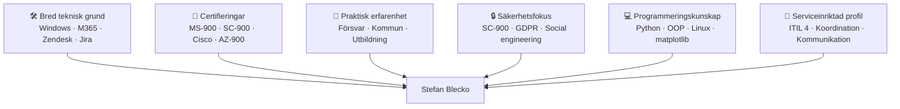

# Välkommen till [Stefan Bleckos](https://twitter.com/minnesbilder) Python/PowerShell sajt 

#### En samling Jupyter Notebooks, konfigurationsfiler och hjälpresurser för administration, certifieringsförberedelser och personliga arbetsflöden. Innehållet är avsett som arbetsmaterial och referens för utveckling, automation och studier. För att se mina inlägg på LinkedIn (som handlar om PowerShell, Python och cloud computing) klicka [här](https://www.linkedin.com/posts/stefan70_mina-senaste-inl%C3%A4gg-%C3%A4ldre-inl%C3%A4gg-https-activity-7340301715868434434-qEJP?utm_source=share&utm_medium=member_android&rcm=ACoAABLNm-IBiq5TlsugIMH7rx0wSvX1qkpzei0).

---

