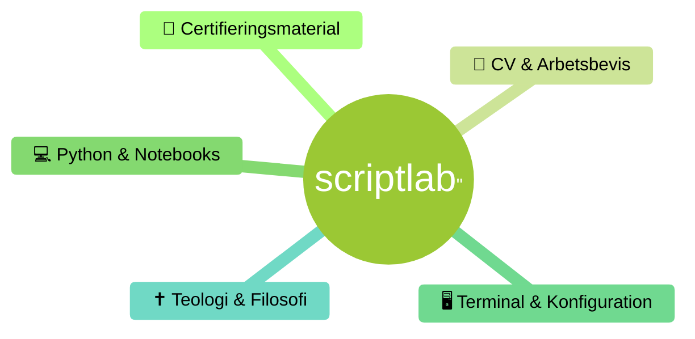

### Detta är en samling filer kopplade till IT-certifiering och kompetensutveckling. Innehållet omfattar studiematerial och övningsdata för Microsoft- (AZ-900, MS-900, MS-102, SC-900, SC-401) samt Cisco-certifieringar, tillsammans med CV-underlag, arbetsbetyg och examensbevis. Vidare finns ett flertal Python-notebooks med övningar i allt från komprimering och kalkylering till AI-utveckling, samt ett eget skript med tillhörande UML-dokumentation. Konfigurationsfiler för PowerShell, VS Code och Vim visar en anpassad utvecklingsmiljö. ###

### *Stefan Blecko* ###
